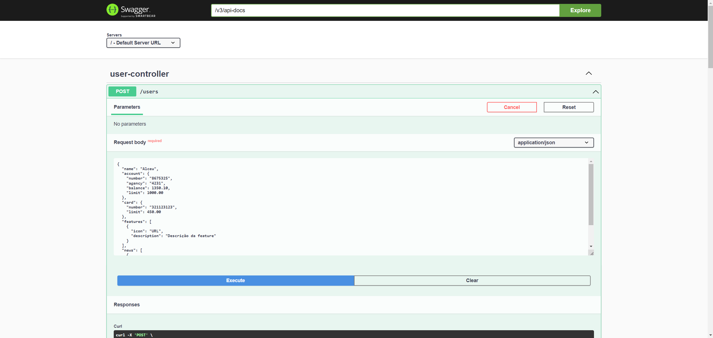
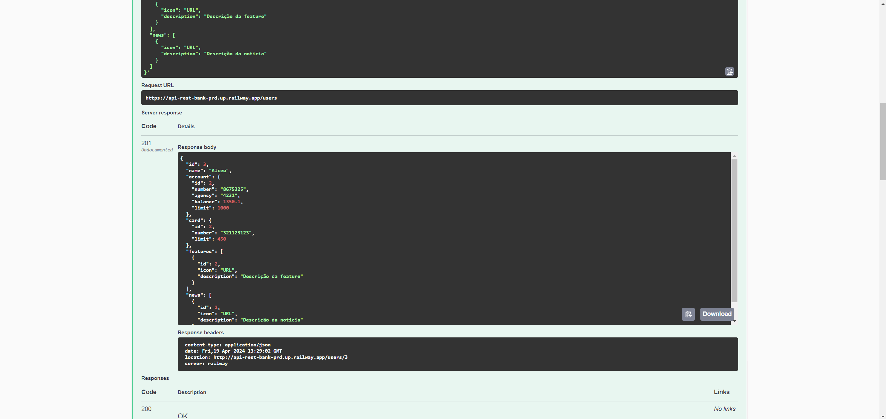
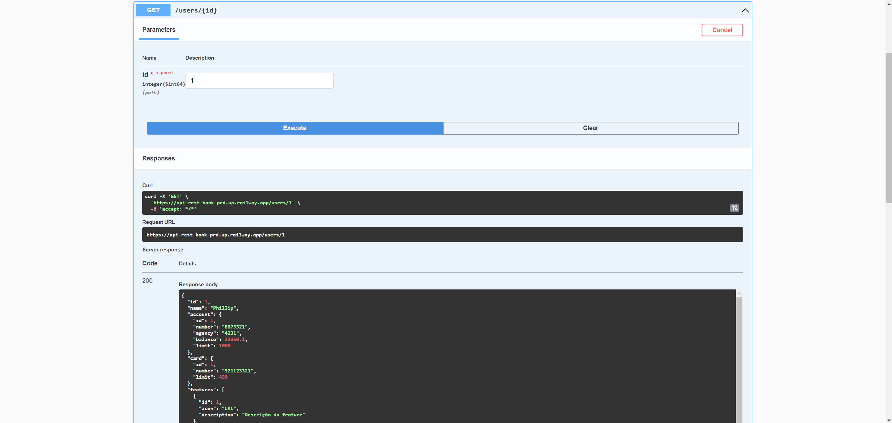

# Sistema Bancário - PhBank

Projeto RESTful de replicação de sistema bancário utilizando SpringBoot 3, Java 17 e Railway

## Tecnologias utilizadas
 - Java 17: Última versão LTS do Java;
 -  Spring Boot 3: Última versão do Spring Boot, maximizando produtividade por meio de autoconfigurações; 
 - Spring Data JPA: Ferramenta para simplificar a camada de dados, facilitando integração com banco de dados SQL;
- OpenAPI (Swagger): Documentação da API, mostrando os endpoints criados, permitindo também testes na aplicação;
- Railway: Infraestrutura em nuvem para deploy e monitoramento de aplicações, além de oferecer bancos de dados como serviços e pipelines CI/CD

## Diagrama de Classes

## Swagger - Documentação da API

[https://api-rest-bank-prd.up.railway.app/swagger-ui/index.html](https://api-rest-bank-prd.up.railway.app/swagger-ui/index.html)

A API está disponível no endpoint acima por um tempo determinado de acordo com o plano Trial do Railway. Abaixo seguem alguns prints dos métodos criados até então:

### Criação de novo usuário

Json contendo os dados do novo usuário cadastrado:

Retorno após a requisição ser salva:

### Buscando usuários pelo ID

Ao inserir o ID do usuário e realizar a busca, é retornado o JSON com a informações do mesmo:

### Exemplo de JSON para testes

JSON contendo as informações a serem enviadas, necessitando apenas preencher os dados que queiram ser enviados:
[JSON_teste](assets/TesteRequest.json)

