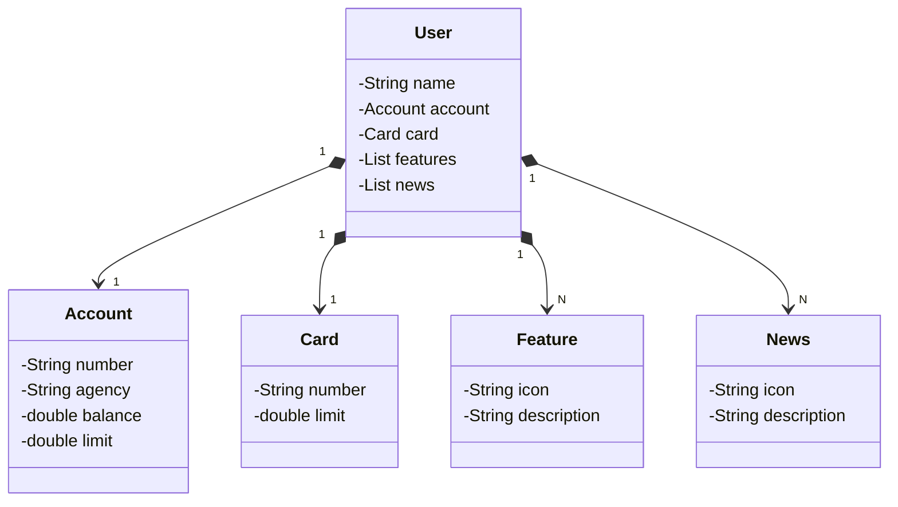

# Sistema Bancário

Projeto de sistema bancário utilizando SpringBoot 3, Java 17 e Railway

## Diagrama de Classes

```mermaid
classDiagram
    class User {
        -String name
        -Account account
        -Card card
        -List<Feature> features
        -List<News> news
    }
    class Account {
        -String number
        -String agency
        -double balance
        -double limit
    }
    class Card {
        -String number
        -double limit
    }
    class Feature {
        -String icon
        -String description
    }
    class News {
        -String icon
        -String description
    }
    
    User "1" *--> "1" Account
    User "1" *--> "1" Card
    User "1" *--> "N" Feature
    User "1" *--> "N" News
```